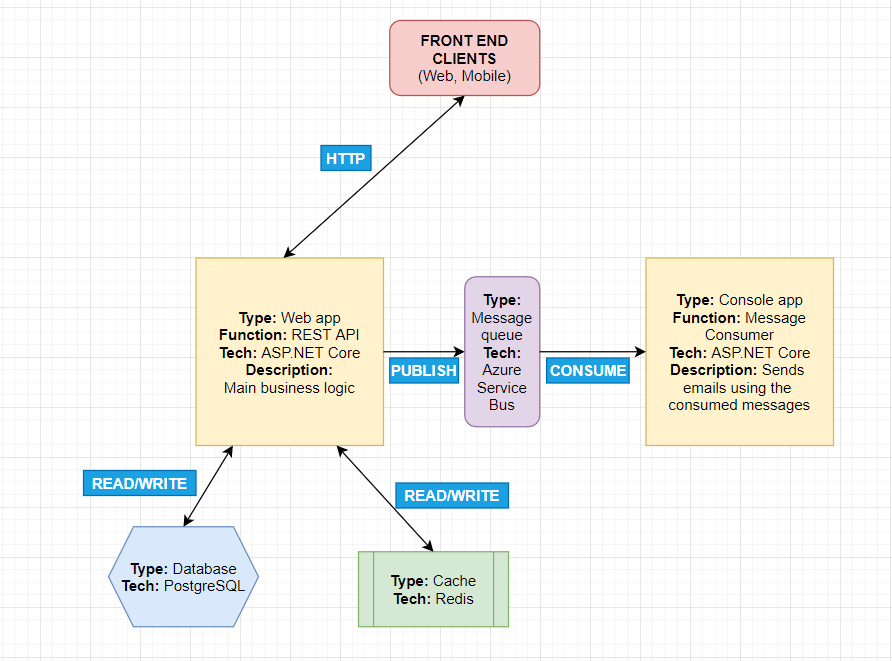

# GoConstruction
## API
**Demo deployment**: https://goapi-demo.azurewebsites.net/
### Overview

GoAPI is the back-end for a hypothetical issue (ticket) tracking software application. Context is the construction industry. Key features are:

- Organisations can sign up and register users at 4 different levels of authority (Worker, Supervisor, Manager, Contractor), each one having different permissions for CRUD operations in various parts of the application.
- Users can create **Sites**: objects that encapsulate large sets of issues.
- Users can create **Jobs**: the units in which issues are specified. A **Job** belongs to a **Site**. A **Job** has a deadline, assignees, comments and tagging of users in the comments. A **Job** may be a child of another **Job**, or sit directly under the enveloping **Site**.
- Relevant users are emailed when updates occur e.g. when an assignee is added or removed from a **Job**, or when some of the data of a resource changes (say **Job** description updated), or when they are mentioned in a comment, etc.
- Updates for a resource can be retrieved: giving an audit trail.

### Dev Stack/Technology Used
The API is an ASP.NET Core WebAPI project:
- Aims to follow REST semantics as closely as possible (e.g. returning _201 Created_ when a new DB entry is created following a _POST_ request);
- EF Core ORM;
- Swagger for docs;
- Service design pattern;
- JWT Claims-based authorization (custom policies where the token notably contains the Seniority of the user and the Organisation they are a part of).

Also use:
- PostgreSQL DB
- Redis cache
- InMemory DB for testing

### Architecture

### Improvements
The API is not stateless in its current form. This is because it keeps a queue (implemented as a `BackgroundService`) on to which email sending jobs are pushed. To make this stateless, we would aim to use a proper message queue flow, say:
  1. Write the email to the DB;
  2. Queue a message to the message queue, passing an instruction to send an email and giving a reference to the saved resource;
  3. Consume the messages somewhere (Console application, Azure Function) and execute the email jobs there.
