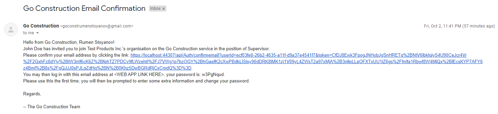
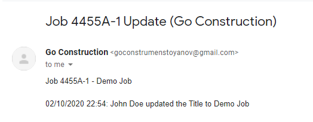
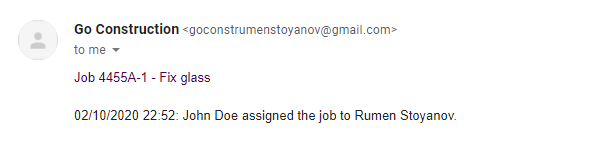

# GoConstruction
## API
**Demo deployment**: https://goapi-demo.azurewebsites.net/ (just to display docs, cache and email disabled).
### Architecture
No front end clients have been created; this appears on the diagram just for completeness. Everything else is made.

### Overview
GoAPI is the back-end for a hypothetical issue (ticket) tracking software application. Context is the construction industry. Key features are:

- Organisations can sign up and register users at 4 different levels of authority (Worker, Supervisor, Manager, Contractor), each one having different permissions for CRUD operations in various parts of the application.

- Users can create **Sites**: objects that encapsulate large sets of issues.
- Users can create **Jobs**: the units in which issues are specified. A **Job** belongs to a **Site**. A **Job** has a deadline, assignees, comments and tagging of users in the comments. A **Job** may be a child of another **Job**, or sit directly under the enveloping **Site**.
- Relevant users are emailed when updates occur e.g. when an assignee is added or removed from a **Job**, or when some of the data of a resource changes (say **Job** description updated), or when they are mentioned in a comment, etc.

- Updates for a resource can be retrieved: giving an audit trail.

### Dev Stack/Technology Used
[API](GoConstruction/GoApi) is an ASP.NET Core WebAPI project:
- Aims to follow REST semantics as closely as possible (e.g. returning _201 Created_ when a new DB entry is created following a _POST_ request);
- EF Core ORM;
- Swagger for docs;
- Service design pattern;
- JWT Claims-based authorization (custom policies where the token notably contains the Seniority of the user and the Organisation they are a part of);
- `Microsoft.Azure.ServiceBus` package to publish messages to a message queue. The messages contain the contents of emails, which are to be sent when updates occur to relevant users.

[Console application](GoConstruction/GoApp.Console) is also _de jure_ an ASP.NET Core application (in the sense that it has a `host`) but with no controllers. It is responsible for consuming messages from the Azure Service Bus queue and constructing emails from them and sending the emails.

- PostgreSQL DB
- Redis cache
- Azure Service Bus

### Notes
- In integration [testing](GoConstruction/GoApi.Tests) (with `WebApplicationFactory`) I have used https://github.com/Zaid-Ajaj/ThrowawayDb (credit: https://github.com/Zaid-Ajaj) to mock Postgres dbs. 
The great approach of using the `Microsoft.EntityFrameworkCore.InMemory` package could not work here, as some models have a `jsonb` field and the in-memory adapter does not support this (whereas the Postgres one does).
- Data Transfer Objects are use extensively, they are stored in the [Class Library Project](GoConstruction/GoLibrary) which is shared between the [API](GoConstruction/GoApi) and [Console App](GoConstruction/GoApp.Console).
